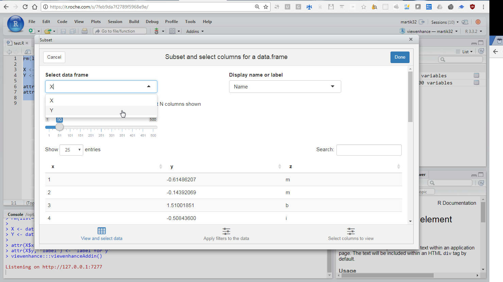
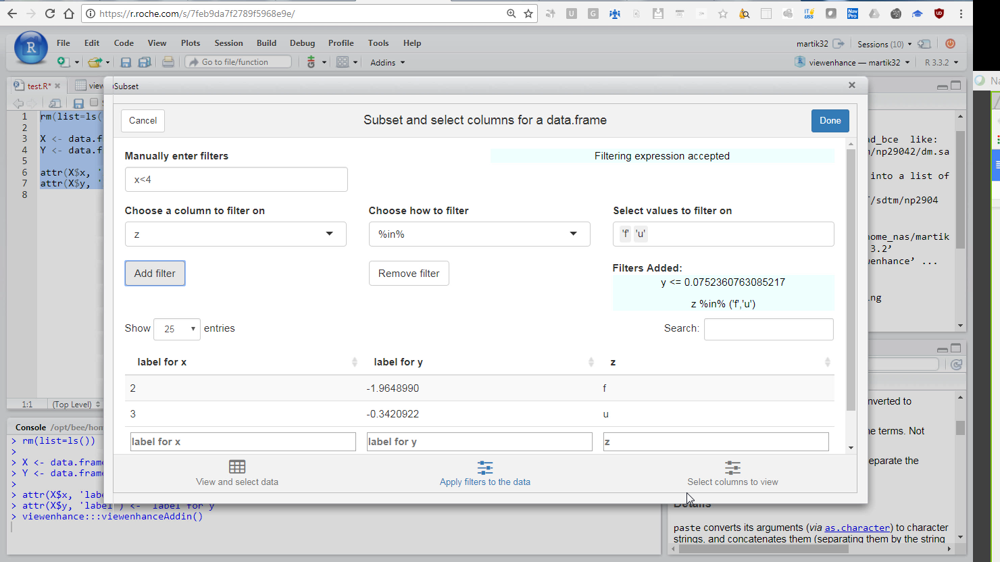
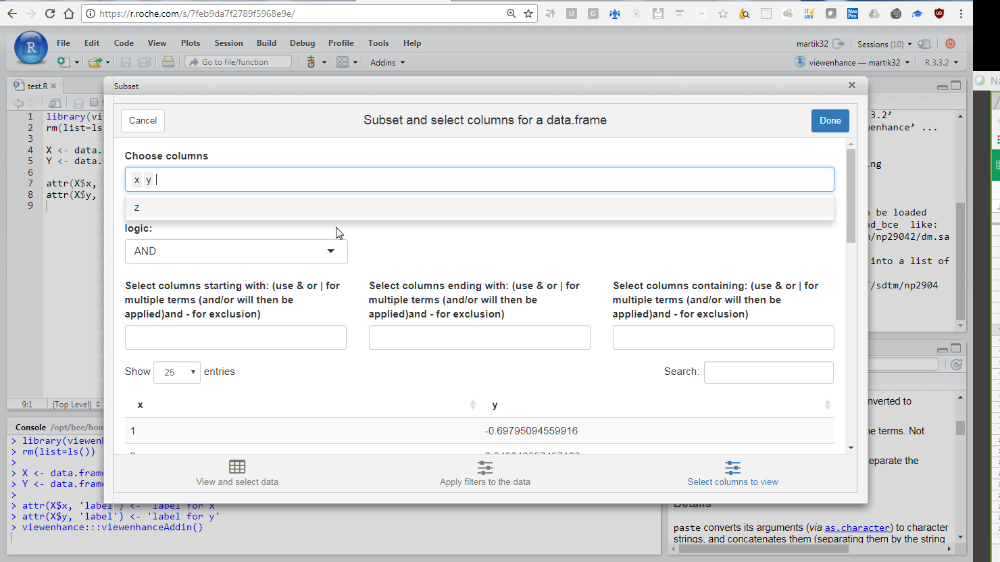
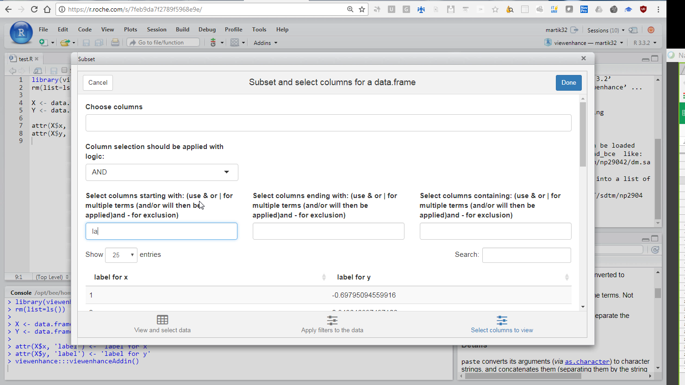

## Introduction 
This package produces an add in for r studio to help browse data.

I like R studios data view, it looks nice and allows infinite scroll. However, it has some limitations. You can filter, but in a somewhat restricted fashion, and you cannot hide columns or select particular ones.

This package is intended to enhance the view. Installing it and calling the library gives you an add on in R Studio. When you click on it, it opens a shiny browser of the data. There you can apply where conditions, and select columns. When you're finished, click done and R Studio will automatically open a View() of the data that you selected. As an added bonus, this will appear in your console, so will be available if you want to save the queries that you used.

This intended to be a quick look at your data rather than an in depth analysis tool, and is designed on that basis.

Please note that this is a work in progress, so any bugs spotted please let me know!

## Getting started

To enable this tool, you will need to install the library. You can do this using devtools, as follows:

    library(devtools)
    install_github("martik32/viewenhance")
    
Then, load the library:

    library(viewenhance)

This will add an "add in" to the `Addins` menu (top of RStudio) called "Enhanced View". You can either select this or run `viewenhance:::viewenhanceAddin()` in your console.

You can also use `viewenhance:::viewenhanceAddin(data_frame)` or `viewenhance:::viewenhanceAddin(list)` with either a data frame or a list of data frames, and the app will use those as inputs instead. 

Note that this function will error if there are no data frames/matrices in your global environment. For an example, run the following code

```r
library(viewenhance)
rm(list=ls())

X <- data.frame(x = seq(1,100), y = rnorm(100), z = sample(letters, 100, replace = T))
Y <- data.frame(matrix(rnorm(10000), ncol = 1000))

attr(X$x, 'label') <- 'label for x'
attr(X$y, 'label') <- 'label for y'
```




This shows the first tab, which can be browsed through the buttons below. Here you can select which data frame to view, and whether to view the column names or their labels. If you move to the filters tab, you see the following.



You can enter filters through free text, and also through the drop down boxes. When adding filters via the drop down box, you need to click the "add filters" button, and "remove filters" to then remove those.

Finally you can select columns.



You can manually select columns from a list, but can also use the last three boxes to enter text restrictions.

The different restrictions on the column selection (individually selecting columns, selecting columns that begin with a letter etc) with either be applied with AND/OR logic depending on your selection.

So for instance, selecting column PT and specifying that the name should begin with A, will, with AND selected, display no columns (as PT does not begin with A). With OR, it will display the column PT and any column beginning with A. See screenshot below for a demonstration of what a query might look like, and notice that you can also select based on label (you will need to have selected label in the first tab)




When finished, click done and this will open your subseted and column selected data set in the R Studio data viewer. You'll also see the logic used to create that view in your console, if you wish to use that particular command again

## Contact

If you have any suggestions/ find any bugs, please do raise an issue.
